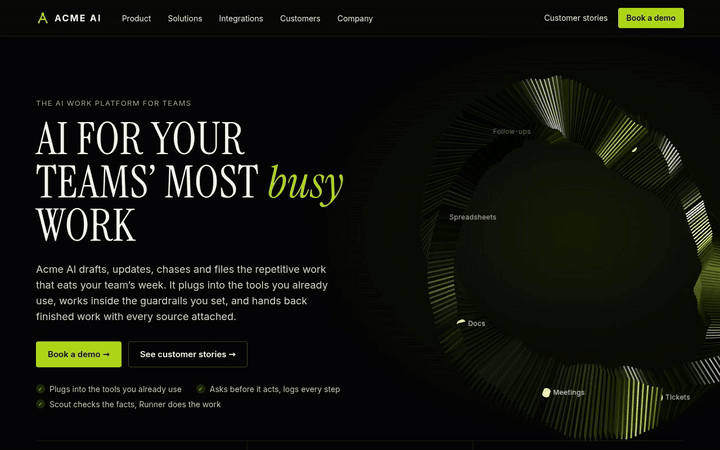
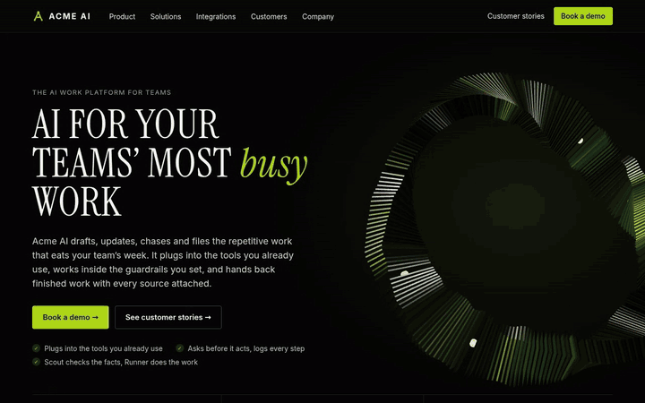
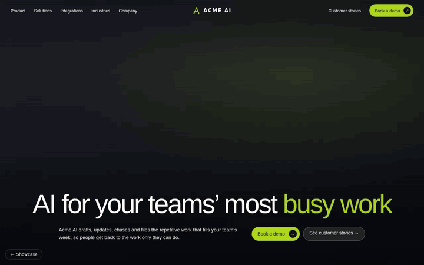

# Homepage Design Showcase: ACME AI

Two animated SaaS homepage concepts for **ACME AI**, a fictional company with one message: *AI for your teams' most busy work*. The same story is told in two very different visual languages, each with its own motion system, layout rhythm and interaction details.

**Live showcase:** enable GitHub Pages (see below) and open `https://rohitabrahamgeorge.github.io/acme-ai-web-showcase/`

> ACME AI is not a real company. Every brand, product, customer, person and number on these pages is invented for this portfolio.

---

## 01 · Editorial Dark



A dark, magazine-like layout with oversized serif headlines, lime highlights and dense product panels.



| Section | What is happening |
| --- | --- |
| Hero | Real-time **Three.js** scene: a twisting loop of 250 metallic slats drawn with a single `InstancedMesh`, studio reflections from a PMREM environment, ten glowing nodes with HTML labels projected onto them every frame, a lime pulse travelling the loop, and gentle tilt that follows the mouse and scroll |
| Bento grid | A second instance of the loop drives the *Capture, Draft, Review, Deliver* chips in sync with its pulse; an infinite approval feed with a floating request card; six counter-scrolling connector marquees; a work log table with a highlight sweeping row by row |
| Stats | Numbers count up when they enter the viewport, over a 650-dot twinkling grid, a live log ticker and an animated equaliser |
| Chapter tabs | Eight tabs auto-advance with a progress bar, pause on hover and only run while visible; each panel has a hand-coded animated SVG illustration |
| Stories, security, FAQ | Snap-scrolling story carousel with a progress rail, metallic SVG security icons, sticky FAQ intro with a single-open accordion |

[Open the page](designs/editorial-dark/) · [Watch the section tour (MP4)](assets/previews/editorial-sections.mp4)

---

## 02 · Cinematic Light



A bright, spacious layout that leans on full-bleed photography, soft neutrals and scroll-driven storytelling.

| Section | What is happening |
| --- | --- |
| Navigation | Transparent over the hero, turns into frosted light glass after scrolling, with the logo recolouring to match |
| Hero | Full-bleed photo with a slow Ken Burns zoom, a scanning line, and a headline that reveals word by word with a blur-in |
| Layer stack | A section pinned with `position: sticky` for about four screens of scroll; seven isometric glass plates (pure CSS 3D transforms and stacked shadows) lift one by one while the matching pill expands and a progress bar fills; clicking a pill scrolls to its layer |
| Product cards | Eight cards, each with a hand-coded animated visual: floating tool chips, a step-by-step task checklist, stacked 3D plates, data masking with a scan line, a playbook library, a dashed perimeter, a workflow graph and an orbiting delivery loop |
| Industries | Centre-mode carousel where the active card grows, with autoplay, hover pause, swipe on touch and animated dots |
| Stats, story, security | Count-up stats, parallax story images, a dark compliance grid and a demo card with a glowing module diagram |

[Open the page](designs/cinematic-light/) · [Watch the tour (MP4)](assets/previews/cinematic-tour.mp4)

---

## How it is built

- **No framework, no build step.** Plain HTML, CSS and JavaScript, one file per page. Three.js r128 is the only library, bundled locally in `assets/vendor/` with CDN fallbacks.
- **Page-builder friendly.** Both pages were first built inside a visual page builder (InnovaStudio / ContentBox), using inline styles so every text, colour and button stays editable in the editor. `assets/css/builder-shim.css` recreates the builder's section, container, row and column framework so the pages run standalone.
- **Motion with manners.** The 3D scene and auto-playing elements pause when off screen, all animation respects `prefers-reduced-motion`, and content is only hidden for reveal effects once JavaScript is running.
- **Responsive.** Layouts are tuned for desktop, tablet and phone, including a mobile menu, horizontally scrolling tabs and a re-flowed layer stack.
- **Self-hosted fonts.** Inter, Inter Tight and Instrument Serif are served from `assets/fonts/`.

## Structure

```
index.html                      Showcase landing page
designs/editorial-dark/         Design 01
designs/cinematic-light/        Design 02
assets/css/builder-shim.css     Page-builder framework shim
assets/fonts/                   Self-hosted web fonts and licences
assets/vendor/three.min.js      Three.js r128
assets/previews/                GIFs, MP4s and poster images
```

## Run locally

```bash
python3 -m http.server 8000
# then open http://localhost:8000
```

## Publish with GitHub Pages

1. Push this folder to a public repository named `acme-ai-web-showcase`.
2. Go to **Settings → Pages**, set **Source** to *Deploy from a branch*, choose `main` and `/ (root)`, then save.
3. After a minute the showcase is live at `https://rohitabrahamgeorge.github.io/acme-ai-web-showcase/`.

## Credits

- Fonts: Inter, Inter Tight and Instrument Serif, under the SIL Open Font License (via Fontsource).
- 3D: [Three.js](https://threejs.org/) r128, MIT License.
- Photography on the Cinematic Light page is loaded from [Unsplash](https://unsplash.com/) under the Unsplash License.

Design and build by Rohit A George.
